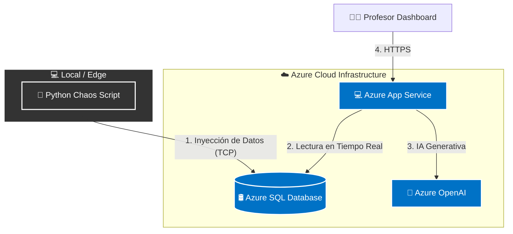

# ☁️ Eduinnovatech: Cloud-Native Real-Time Exam Platform


> **Eduinnovatech** es una plataforma educativa experimental diseñada para gestionar evaluaciones masivas en tiempo real. Este proyecto demuestra una arquitectura **Híbrida y PaaS** utilizando Microsoft Azure, simulando un entorno de alta concurrencia mediante inyección de datos sintéticos.

---

## 🏗️ Arquitectura del Sistema

El proyecto implementa un flujo de datos moderno donde la ingesta, el procesamiento y la visualización están desacoplados.



---

##

🧩 Componentes Clave

- **Azure SQL Database**: Persistencia de datos relacional escalable.

- **Python Simulation Engine**: Scripts locales (Faker) que emulan el comportamiento de miles de estudiantes realizando exámenes simultáneamente.

- **Streamlit & Docker**: Interfaz de visualización contenerizada para despliegue continuo (CI/CD).

🚀 Instalación y Configuración (Para Desarrolladores)

Sigue estos pasos para levantar el entorno de desarrollo local.

1. Prerrequisitos

- Python 3.9+

- Cuenta de Azure activa (con SQL Database creada).

- ODBC Driver 17/18 for SQL Server.

1. Clonar el repositorio

```bash
git clone https://github.com/GabrielFersPin/Eduinnovatech.git
cd Eduinnovatech
```

1. Configurar Entorno Virtual

```bash
python -m venv venv

# En Windows

.\venv\Scripts\activate

# En Mac/Linux

source venv/bin/activate
```

1. Instalar Dependencias

```bash
pip install -r requirements.txt
```

1. Configurar Variables de Entorno

Crea un archivo .env en la raíz del proyecto (este archivo está ignorado por git por seguridad). Copia el siguiente formato y rellena con tus datos de Azure:

```ini

DB_SERVER=tu-servidor.database.windows.net
DB_NAME=sql-eduinnovatech-db
DB_USER=tu_usuario_admin
DB_PASSWORD=tu_password_secreto
```

🎮 Uso y Simulación
Paso 1: Inicializar la Base de Datos

Ejecuta este script una sola vez para crear las tablas necesarias en Azure si están vacías.

```bash
python init_db.py
```

Paso 2: Iniciar el "Motor de Caos" (Simulador)

Este script comenzará a generar alumnos y notas falsas cada pocos segundos, enviándolos a la nube.

```bash
python data_generator.py
```

Deberías ver logs como: 👨‍🎓 Alumno: María | 📝 Nota: 85

Paso 3: Lanzar Dashboard (Próximamente)

```bash
streamlit run app.py
```

---

## 🗺️ Roadmap & Data Journey

Este proyecto sigue una evolución incremental basada en competencias profesionales de Cloud & Data Engineering:

- [x] Fase 1: Infraestructura Base (Azure SQL) + Scripts de Ingesta (Python).

- [ ] Fase 2: Desarrollo de Dashboard de Analítica (Streamlit).

- [ ] Fase 3: Containerización y Despliegue (Docker + Azure ACR).

- [ ] Fase 4: Integración de IA para generación de preguntas (Azure OpenAI).

👥 Autores

- Gabriel - Cloud Architecture & Data Engineering

- [Nombre de tu Compañero]
