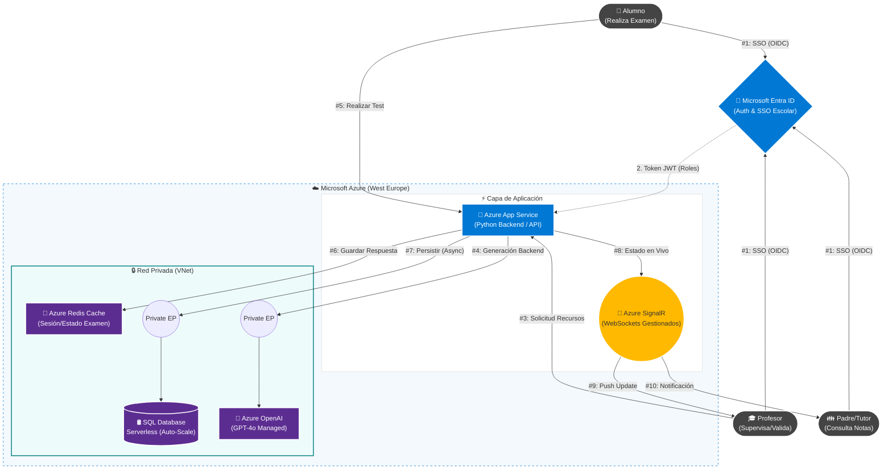

# ☁️ Eduinnovatech: Cloud-Native Real-Time Exam Platform

## 1. Visión General y Objetivos

**EduInnovatech** nace con la misión de democratizar la tecnología educativa de alto rendimiento. El proyecto no es solo una herramienta de evaluación, sino un ecosistema integral que conecta a **Alumnos, Profesores y Familias** en un entorno seguro y escalable.

### 1.1. El Reto de la Dualidad Operativa

El sistema debe resolver dos escenarios de carga diametralmente opuestos utilizando la misma infraestructura para garantizar la viabilidad económica:

1. **Modo "Jornada Escolar" (Uso Continuo):**
    * **Horario:** Lunes a Viernes, 08:00 - 17:00.
    * **Actividad:** Tráfico constante pero moderado. Monitorización de tareas, creación de contenido asistida por IA y consulta de métricas por los padres.
2. **Modo "Olimpiada Interescolar" (Evento Masivo):**
    * **Horario:** Ventanas puntuales (ej: 2 horas al trimestre).
    * **Actividad:** Picos de concurrencia extrema (50.000 alumnos simultáneos) compitiendo en tiempo real entre colegios.

---

## 2. Arquitectura de la Solución

La solución implementa una arquitectura **Hub-and-Spoke** en la nube de Microsoft Azure, priorizando servicios gestionados (PaaS) y modelos de pago por uso (Serverless).

### 2.1. Diagrama de Componentes (Nivel Lógico)

### 2.2. Descripción de Componentes Clave

|**Componente**|**Servicio Azure**|**Función Crítica**|
|---|---|---|
|**Backend**|Azure App Service (Linux)|Ejecuta la lógica de negocio en Python. Escala horizontalmente (más instancias) durante la Olimpiada.|
|**Tiempo Real**|**Azure SignalR Service**|Gestiona miles de conexiones WebSocket simultáneas. Permite a los profesores ver el progreso de los alumnos en vivo sin saturar el servidor web.|
|**Base de Datos**|**SQL Database Serverless**|El corazón del ahorro. Se pausa o reduce al mínimo por las noches y escala a 40-80 vCores durante el examen automáticamente.|
|**Caché**|Azure Redis Cache|Almacena el estado temporal del examen (ej: pregunta actual) para reducir la latencia y descargar la base de datos SQL.|
|**IA**|Azure OpenAI Service|Motor de generación de preguntas y corrección automática. Desplegado en red privada para garantizar la privacidad.|

---

## 3. Justificación Tecnológica y Económica (FinOps)

La elección de Azure frente a AWS o Google Cloud se fundamenta en la **adaptabilidad al ciclo escolar**.

### 3.1. Modelo de Costes Dinámico

La competencia obliga a provisionar recursos fijos (pagar por la capacidad máxima las 24h). Nuestra arquitectura Azure Serverless paga solo por la demanda real:

* **Fase Nocturna (19:00 - 07:00):** Tráfico nulo. SQL Serverless se pausa. **Coste: ~0€/hora**.

* **Fase Diaria (08:00 - 17:00):** Tráfico medio (Clases). SQL escala a 2 vCores. **Coste: ~0.5€/hora**.

* **Fase Evento (Olimpiada):** Tráfico crítico. SQL escala a 40 vCores. **Coste: ~10€/hora (solo durante 2h)**.

> **Resultado:** Un coste mensual estimado de **~75€** frente a los **>280€** que costaría mantener una infraestructura equivalente en AWS RDS o Google Cloud SQL.

### 3.2. Integración B2B (Colegios)

El uso de **Microsoft Entra ID** elimina la barrera de entrada. Los 50.000 alumnos acceden con su cuenta de _Microsoft 365 Education_ del colegio. No gestionamos contraseñas, reducimos riesgos de seguridad y facilitamos el despliegue en nuevos centros.

---

## 4. Seguridad, Privacidad y RGPD

El tratamiento de datos de menores es el requisito no funcional más estricto del sistema.

### 4.1. Estrategia de Defensa en Profundidad

1. **Identidad (RBAC):** Implementación de control de acceso basado en roles.

    * _Padres:_ Solo pueden ver los registros (Row-Level Security) asociados al ID de su hijo.

    * _Profesores:_ Acceso a datos agregados de su clase, pero no de otros colegios.

2. **Aislamiento de Red (VNet Integration):**

    * La Base de Datos y el servicio OpenAI **NO tienen acceso público**.

    * La comunicación Backend-Datos viaja por la red troncal de Azure mediante **Private Endpoints**, invisible a internet.

3. **Protección de IA:** Contrato Enterprise con Microsoft que garantiza que los datos de entrada (exámenes, respuestas de alumnos) **no se utilizan para entrenar modelos públicos**.

---

## 5. Aplicación Estratégica de la Inteligencia Artificial

EduInnovatech integra **Azure OpenAI Service (GPT-4o)** no como una funcionalidad final de usuario (tipo chatbot), sino como un **motor de infraestructura lógica** que permite a la startup escalar su oferta de valor sin aumentar los costes operativos humanos.

### 5.1. Automatización de la Producción de Contenidos

La startup utiliza la IA para eliminar el "cuello de botella" de la creación manual de ejercicios.

* **Generación Procedural de Pruebas:** El sistema permite crear miles de variantes únicas de un mismo examen en segundos, adaptadas a distintos niveles de dificultad, garantizando que cada olimpiada cuente con material original sin requerir un equipo editorial masivo.

### 5.2. Escalabilidad en la Evaluación

Para competir con grandes plataformas, la startup necesita ofrecer corrección inmediata en preguntas complejas (no solo tipo test), algo inviable con algoritmos tradicionales.

* **Análisis Semántico a Escala:** La plataforma utiliza la IA para evaluar respuestas abiertas y de desarrollo en tiempo real, proporcionando feedback pedagógico instantáneo a 50.000 alumnos simultáneamente, una capacidad que requeriría miles de profesores humanos trabajando al unísono.

---

## 6. Roadmap y Plan de Crecimiento

Aunque la arquitectura actual (v1.0) es totalmente funcional y eficiente en costes, hemos definido un plan estratégico de evolución técnica y funcional a 24 meses.

### 6.1. Fase 1: Robustez y Seguridad Avanzada (Mejoras Necesarias)

Horizonte: Q3 - Q4 (Post-Lanzamiento)

El objetivo inmediato es blindar la plataforma ante ataques complejos durante las Olimpiadas.

1. **Seguridad Perimetral (WAF):**

    * **Implementación:** Despliegue de **Azure Front Door**.

    * **Justificación:** Actúa como Firewall de Aplicaciones Web (WAF) para detener ataques DDoS coordinados durante el evento, garantizando que el examen no se interrumpa.

2. **Alta Disponibilidad Geográfica:**

    * **Implementación:** _Auto-Failover Groups_ en SQL Database hacia una región secundaria (ej: Norte de Europa).

    * **Justificación:** RTO < 1h en caso de catástrofe en la región principal.

### 6.2. Fase 2: Expansión Funcional (Producto Premium)

Horizonte: Año 1

Introducción de características de alto valor para justificar el modelo de suscripción.

1. **Analítica Avanzada (Business Intelligence):**

    * **Implementación:** Integración de **Power BI Embedded**.

    * **Valor:** Permitir a los directores visualizar comparativas de rendimiento histórico y detección temprana de fracaso escolar.

2. **Modo Offline (PWA):**

    * **Implementación:** Progressive Web App con sincronización diferida.

    * **Valor:** Continuidad del examen incluso si el WiFi del colegio falla.

### 6.3. Fase 3: Escala Global y Nuevos Modelos

_Horizonte: Año 2+_

1. **Modelo B2C (Directo a Familias):**

    * **Implementación:** **Azure AD B2C** para registro de padres independientes.

    * **Objetivo:** Venta de "Packs de Refuerzo" para estudiar en casa.

2. **Expansión a Latinoamérica:**

    * **Implementación:** Réplica de infraestructura en región **Brazil South**.

    * **Justificación:** Aprovechar la estacionalidad inversa (invierno lectivo en LatAm durante el verano español) para mantener ingresos todo el año.

---

## 7. Conclusión

**EduInnovatech** demuestra que una arquitectura **Cloud Native** bien diseñada permite a una startup ofrecer servicios de nivel empresarial. Al combinar la potencia de **Azure SignalR** para la experiencia en tiempo real, la seguridad de **Entra ID** para la gestión de usuarios y la elasticidad de **SQL Serverless** para los costes, hemos creado una plataforma sostenible, segura y preparada para liderar el futuro de la educación digital.
